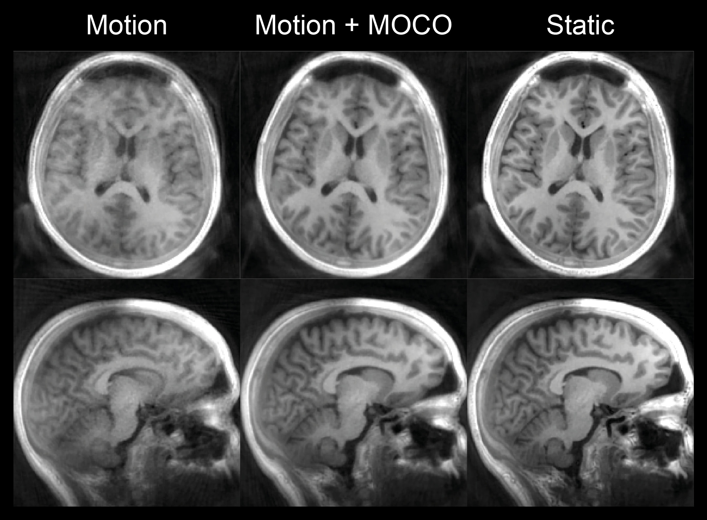

.. pyMERLIN documentation master file, created by
   sphinx-quickstart on Mon Dec 14 13:52:27 2020.
   You can adapt this file completely to your liking, but it should at least
   contain the root `toctree` directive.

pyMERLIN Documentation
====================================

MERLIN - Motion Elimination in Radial acquisition Leveraging Interleaved Navigators

Example of MERLIN

Todo list
-------------
Features to implement:

   - [ ] MOCO pipeline: 

Documentation to write:

.. toctree::
   :hidden:
   :caption: Getting Started

   getting_started

.. toctree::
   :hidden:
   :caption: Core functionality

   moco
   recon
   dataIO
   reg

.. Indices and tables
.. ==================

.. * :ref:`genindex`
.. * :ref:`modindex`
.. * :ref:`search`
